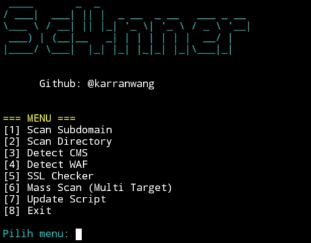

# Sc4nner

Sc4nner adalah tools pentest ringan berbasis Python untuk melakukan:

1. Scan subdomain

2. Scan directory

3. Detect CMS

4. Detect WAF

5. Cek SSL certificate

6. Mass Scan multi target


Dirancang untuk cepat, mudah digunakan, dan stealthy jika diperlukan.


---

## Features

1. Subdomain enumeration

2. Directory brute force

3. CMS detection (WordPress, Joomla, Drupal, Magento, PrestaShop)

4. WAF detection (Cloudflare, Sucuri, DDoS-Guard)

5. SSL certificate expiration check

6. Mass scan multiple target

7. Support stealth mode (random delay, random user-agent)

8. Auto save hasil ke folder /hasil/


---

## Installation

1. Clone repository:

```bash
git clone https://github.com/karranwang/sc4nner.git
```

```bash
cd sc4nner
```

2. Install dependencies:

```bash
pip install -r requirements.txt
```

---

## Usage

Jalankan tools:

```bash
python sc4nner.py
```

Ikuti menu interaktif yang tersedia. jika ingin menggunakan Mass Scann edit file di 

```bash
nano targets.txt
```


---

## Configuration

File config.json untuk pengaturan:

{

  "threads": 30,
  
  "timeout": 5,
  
  "stealth_mode": false,
  
  "delay_min": 1,
  
  "delay_max": 3,
  
  "user_agents_rotate": true,
  
  "save_report": true
  
}

stealth_mode: Jika true, akan delay acak antar request untuk menghindari block.

user_agents_rotate: Randomize User-Agent header untuk tiap request.


---

Screenshot

Tampilan utama:

<p align="center">
  
</p>
---

Project Structure

sc4nner/

├── hasil/                  # Folder hasil scan

├── common_subdomains.txt        # Wordlists Sudbomain

├── common_dirs.txt              # Wordlists Directory


├── img.jpg                 # Screenshot untuk README

├── sc4nner.py              # Source code utama

├── config.json             # Config file

├── requirements.txt        # Python dependencies

└── README.md               # Dokumentasi


---

Credits

Dibuat oleh @karranwangreal

Open Source Project — feel free to contribute!


---

License

This project is licensed under the MIT License - see the LICENSE file for details.
